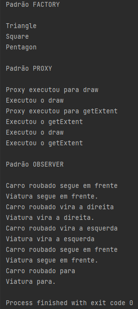

# Projetinho utilizando alguns padrões de projeto

Escolhi alguns padrões de projeto da minha escolha com base no que foi ensinado pelo curso da **DIO**.
A **DIO** mostrou o Singleton, Strategy e Facade, então o meu projetinho leva em conta os padrões abaixo:
- Factory (criacional)
- Proxy (estrutural)
- Observer (comportamental)

## Factory
Apliquei esse padrão para criar uma Interface ```Polygon``` que vai servir de modelo para as classes ```Triangle```, ```Square``` e ```Pentagon```.
Posteriormente criei a classe ```PolygonFactory``` que vai checar o número de lados, instanciar a classe adequada e retornar a descrição do polígono.

## Proxy
Criei a classe ```Image``` e a classe ```ImageProxy``` que vai ser proxy da classe ```Image```.

## Observer
Aqui há a classe ```CarroRoubado``` e a classe ```CarroPolicia```. A classe ```CarroPolicia``` vai ser **observadora** da classe ```CarroRoubado```, isso é,
vai saber as mudanças de estado da classe ```CarroRoubado``` e agir de acordo com o predeterminado.

### Como executar?

Não há segredo, somente execute o projeto na IDE de sua preferência e veja os resultados no terminal, ou altere o código da forma que quiser.
Eu separei cada padrão de projeto para ser visualizado facilmente via terminal.

## Projeto sendo executado:

